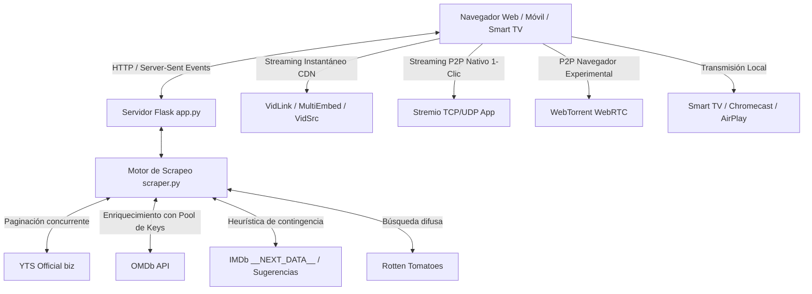

# 🎬 CinemaFilter — Especificaciones Técnicas y Funcionales

> **Documento Maestro de Especificaciones**  
> Este archivo describe en su totalidad la arquitectura, reglas de negocio, flujos de datos, APIs, interfaz y componentes del proyecto **CinemaFilter**. Debe ser utilizado como contexto de referencia en consultas y prompts futuros.

---

## 1. Propósito y Misión

**CinemaFilter** es una aplicación web full-stack diseñada para resolver el problema de calidad en los catálogos de películas torrent (principalmente YTS). Permite descubrir películas con **altos estándares de crítica y popularidad real**, eliminando el "ruido" de películas con puntuaciones infladas por pocos votos.

### Desafío Principal de Filtrado:
1. **Calificación IMDb $\ge 7.0$**.
2. **Número de votos en IMDb $> 500$** (filtro estricto obligatorio que descarta títulos con calificaciones artificialmente altas).
3. **Calificación Rotten Tomatoes (Filtro Híbrido)**:
   - Se extraen tanto el **Tomatometer** (Crítica) como el **Popcornmeter / Audience Score** (Audiencia).
   - Modalidad por defecto: Si están disponibles, exige $\ge 60\%$ en ambos; si Rotten Tomatoes aún no tiene ficha o calificación para ese título reciente, no se descarta si cumple IMDb. Modo estricto opcional disponible.
4. **Filtros de Catálogo**:
   - Año de estreno seleccionable (por defecto **2026**, con histórico y año personalizado).
   - Género seleccionable (por defecto **all / todos**).
   - Ordenación configurable: más recientes (`latest`), mayor rating (`rating`), más seeds (`seeds`), más peers (`peers`), año (`year`).

---

## 2. Arquitectura del Sistema

### Tecnologías Utilizadas:
- **Backend**: Python 3.12+, Flask, Server-Sent Events (SSE), Requests, BeautifulSoup4, ThreadPoolExecutor.
- **Frontend**: HTML5 Semántico, Tailwind CSS (Dark Cinematic Theme), Lucide Icons, WebTorrent JS, HTML5 Video & Remote Playback API.
- **Seguridad**: Autenticación multi-clave mediante variable de entorno `APP_PASSWORDS` con protección CSRF en sesiones permanentes.
- **Repositorio Git**: Sincronizado en `https://github.com/damimontefiori/CinemaFilter`.

---

## 3. Módulos y Componentes Clave

### 3.1 Backend: `scraper.py`
- **Mapeo de Categorías y Años**: Valida géneros soportados por YTS y genera URLs con query parameters exactos.
- **Pool de API Keys de OMDb**: Distribuye las consultas entre claves de respaldo (`trilogy`, `thewdb`, etc.) para garantizar alta disponibilidad de votos y ratings.
- **Scraper de Respaldo IMDb**: Si OMDb no tiene votos para un título muy reciente, extrae directamente del HTML de IMDb o de su script JSON-LD / `__NEXT_DATA__`.
- **Scraper de Rotten Tomatoes**: Búsqueda difusa por título y año, extrayendo Tomatometer y Popcornmeter.
- **Extracción de Torrents y Magnets**: Extrae enlaces magnet directos en calidades 720p, 1080p, 2160p (4K) y sus respectivos tamaños.
- **Ejecución Concurrente**: `ThreadPoolExecutor` para analizar en paralelo los detalles de 20 películas por página sin congelar el servidor.

### 3.2 Backend: `app.py`
- **Autenticación Multi-Clave**: Middleware `@app.before_request` que valida si la sesión está autenticada contra `APP_PASSWORDS` (separadas por coma en `.env`).
- **Endpoint SSE `/api/scan`**: Transmite en tiempo real el progreso de cada película analizada (Aprobada o Descartada con el motivo exacto). Permite cancelación instantánea por parte del usuario.
- **Endpoint Exportación `/api/export`**: Genera un archivo CSV con las películas aprobadas, sus ratings, votos y enlaces magnet.
- **Servidor Dual**: Escucha en `0.0.0.0:5000`, permitiendo acceso tanto en `http://localhost:5000` como desde dispositivos móviles y Smart TVs en la red Wi-Fi local (ej. `http://192.168.1.118:5000`).

### 3.3 Frontend: `templates/index.html` y `templates/login.html`
- **Diseño Ultra-Moderno**: Dark mode cinematográfico con gradientes esmeralda, métricas en vivo y barra de progreso animada.
- **Pestañas Dinámicas**:
  - **Aprobadas**: Fichas completas con póster HD, rating IMDb en dorado, badge de votos, badges de Rotten Tomatoes, sinopsis, magnets por calidad y botón de reproducción.
  - **Descartadas**: Tabla con el desglose exacto de por qué cada película no superó el filtro (ej. *"IMDb rating 6.4 < 7.0"*, *"Votos IMDb: 120 <= 500"*).
- **Acciones Rápidas**: Copiar enlace magnet individual, copiar todos los magnets al portapapeles, exportar a CSV, abrir en cliente torrent.

---

## 4. Motor de Reproducción y Streaming

Para superar la limitación técnica de los navegadores web (los navegadores **no permiten sockets TCP/UDP directos**, lo cual estanca a WebTorrent en 0-1 peer WebRTC), el reproductor cuenta con una arquitectura híbrida de 4 vías:

### Vía 1: Streaming Instantáneo CDN (Por Defecto)
Aprovecha el **IMDb ID** (`tt...`) extraído de cada película aprobada para conectarse a redes CDN dedicadas:
- **Servidor 1 (VidLink CDN HD)**: Inicia en 1-2 segundos en 1080p/720p con buffer fluido.
- **Servidor 2 (MultiEmbed VIP/HD)**: Múltiples servidores de respaldo de alta velocidad.
- **Servidor 3 (VidSrc HD)**: Servidor clásico de alta disponibilidad.

### Vía 2: P2P Nativo 1-Clic (Stremio)
- Botón **`Abrir en Stremio`** (`stremio://${magnet}`).
- Abre la app de Stremio en PC, móvil o Android TV con acceso total a los **500+ seeders TCP/UDP** descargando a 30-50 MB/s.

### Vía 3: P2P WebTorrent en Navegador
- Pestaña secundaria con cliente WebTorrent integrado.
- Descarga secuencial priorizando las primeras piezas para permitir reproducción y botón para guardar el archivo en la carpeta Descargas.

### Vía 4: Transmisión a la TV (Casting)
- Botón **`Transmitir a la TV`**:
  - En **iOS / Safari**: AirPlay nativo en pantalla completa.
  - En **Android / Chrome**: Google Cast a Chromecast o Smart TVs.
  - En **Smart TV**: Navegador integrado de la TV abriendo directamente `http://<IP_LOCAL>:5000`.

---

## 5. Módulo de Subtítulos y Audio en Español (Multi-Fuente)

### 5.1 Subtítulos en Español Sincronizados (`subtitles.py`)
- **Proveedor Principal (OpenSubtitles v3 - CDN oficial de Stremio)**:
  - Consulta `https://opensubtitles-v3.strem.io/subtitles/movie/{imdb_id}.json`.
  - Cobertura masiva de películas y estrenos sin requerir API key ni registrar cuentas.
  - Filtro por dialectos hispanos: `spa`, `es`, `es-mx`, `es-es`, `spa-es`, `spa-mx`.
  - Descarga directa en UTF-8 con detección automática de codificaciones (`utf-8`, `cp1252`, `latin-1`, `iso-8859-1`).
- **Proveedor Secundario (YIFY Subtitles)**:
  - Scrapea `https://yifysubtitles.ch/movie-imdb/{imdb_id}` para obtener subtítulos específicamente sincronizados con los releases de YTS.
- **Conversor SRT a WebVTT**:
  - Convierte en memoria los subtítulos `.srt` a formato WebVTT estándar (`WEBVTT` + timestamps `00:00:00.000 --> 00:00:00.000`) para etiquetas `<track>` de video HTML5.
- **Endpoints de Subtítulos**:
  - `GET /api/subtitles/<imdb_id>`: Metadatos de subtítulos disponibles en español.
  - `GET /api/subtitles/vtt/<imdb_id>`: Sirve la pista WebVTT directamente con cabeceras CORS y `Content-Type: text/vtt; charset=utf-8`.
  - `GET /api/subtitles/download/<imdb_id>`: Descarga del archivo `.srt` con cabeceras `Content-Disposition: attachment; filename="..."` y CORS.
- **Integración UI Asíncrona (`downloadSubtitle`)**:
  - Botón **`[Subtítulos ES]`** en cada tarjeta de película y **`[Subtítulo .SRT]`** en la barra del reproductor.
  - Descarga asíncrona mediante `fetch` y Blob: **nunca abre pestañas en blanco ni muestra JSON crudo al usuario**.
  - Si un subtítulo no estuviera disponible, muestra una notificación emergente (Toast) explicativa en la propia interfaz.

### 5.2 Catálogo P2P en Audio Latino y Castellano (`latino_sources.py`)
- **Indexador P2P Torrentio (Cinecalidad, TorrentGalaxy, DonTorrent, etc.)**:
  - Búsqueda P2P por `imdb_id` en el catálogo en español y audio latino.
  - Clasificación automática con badges (`[🇲🇽 Audio Latino]` / `[🇪🇸 Castellano]`), conteo de seeders, peso en GB y calidad.
- **Lanzador Seguro de Protocolos (`launchStremio` y `launchMagnet`)**:
  - Invocación de protocolos externos (`stremio://` y `magnet:`) a través de un iframe invisible en segundo plano.
  - **Previene al 100% el error `about:blank#blocked` de Google Chrome**.
  - Copia automática instantánea del enlace magnet al portapapeles como respaldo garantizado.
  - Botones dedicados en el modal de Fuentes en Español:
    - `[▶ Abrir en Stremio]`: Lanza Stremio Desktop con el stream listo para reproducir.
    - `[🧲 Abrir Torrent]`: Lanza el cliente torrent predeterminado del sistema (qBittorrent, etc.).
    - `[📋 Copiar Magnet]`: Copia el enlace magnet con confirmación visual.
    - `[💾 Descargar .torrent]`: Descarga directa del archivo torrent limpio.
- **Endpoint Backend**:
  - `GET /api/latino/<imdb_id>?title={title}&year={year}`.
  - `GET /api/latino/torrent_download?url={url}&filename={filename}`: Proxy para descargar archivos `.torrent` evitando bloqueos de CORS y hotlink.

---

## 6. Diagnóstico de Seguridad de Fuentes Externas

> [!CAUTION]
> **Honeypot detectado en `cinecalidades.com`**:
> - La investigación técnica del código fuente (`/download.js`) reveló que los botones de descarga redirigen a ejecutables empaquetados (`https://megaup.net/.../setup74ujii8tij4.zip`) para distribuir adware/malware.
> - El sitio no contiene torrents reales de video ni streams legítimos. Fue descartado de la integración para proteger la seguridad del usuario.
>
> **Dominio inaccesible `cinecalidad.am`**:
> - El dominio original `cinecalidad.am` se encuentra dado de baja (`[Errno 11001] getaddrinfo failed`).
> - Se reemplazó por fuentes verificadas y seguras: **DonTorrent** (`dontorrent.link`) y **MultiEmbed** con selector de audio latino `[LAT]`.

